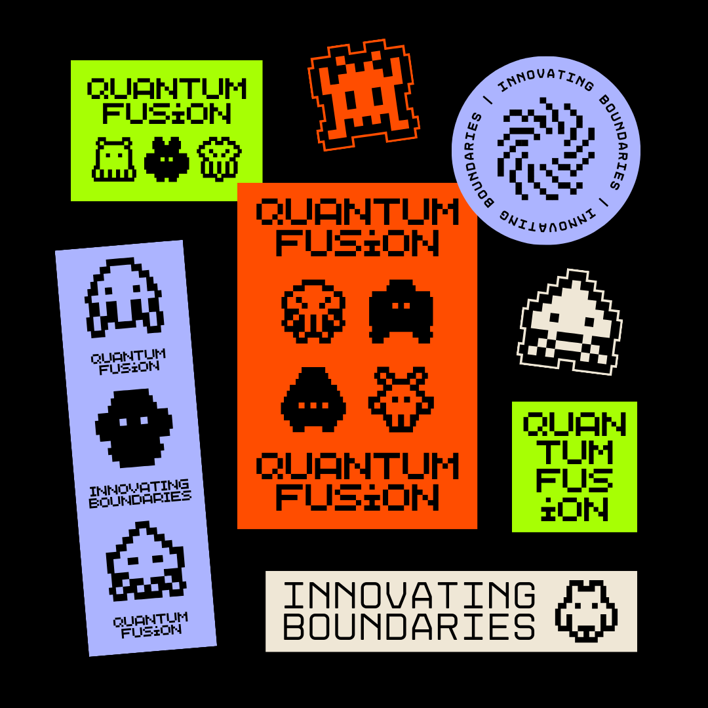

# QuantumMatlabHub 🚀

<p align="center">
  
</p>

Welcome to QuantumMatlabHub, a centralized hub for advanced MATLAB projects that explore the realms of computational mathematics, quantum computing, and data-driven insights.

## 🌟 Highlighted Features

- 🚀 Cutting-edge MATLAB projects.
- 📊 Rich visualizations and plots.
- 🤖 Innovative numerical computations.
- 🧠 Thought-provoking data analysis.

## 🚀 Overview

QuantumMatlabHub is dedicated to pushing the boundaries of what's possible with MATLAB. Our projects delve into various domains, from quantum computing simulations to advanced machine learning applications. Each project is crafted with a focus on innovation, performance, and educational value.

## 🛠️ Installation

To experience the projects in QuantumMatlabHub, you'll need MATLAB installed on your machine. Clone this repository to your local environment:

```bash
git clone https://github.com/ThecoderPinar/QuantumMatlabHub.git

cd QuantumMatlabHub

